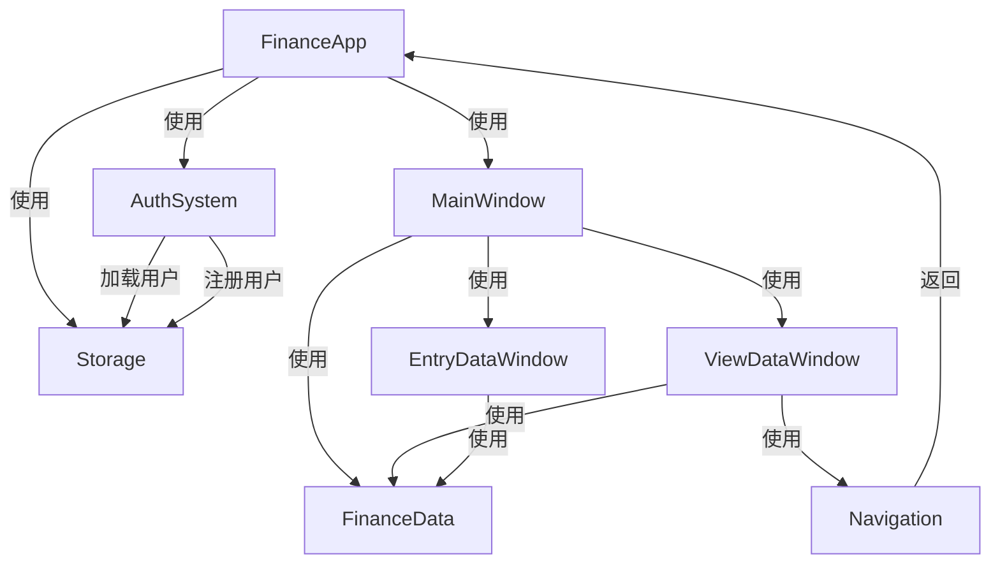
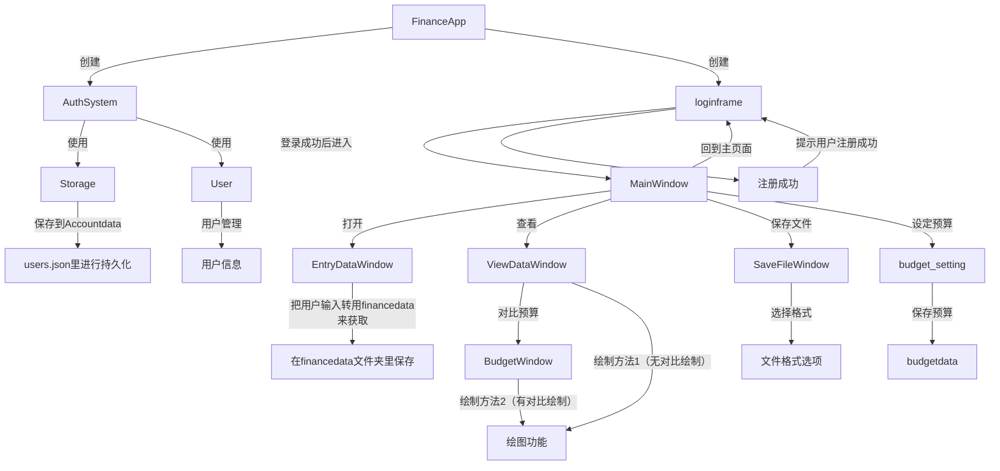

# 这些窗口背后都调用什么

```mermaid
graph TD;
    A[FinanceApp] -->|使用| B[AuthSystem]
    A -->|使用| C[MainWindow]
    A -->|使用| D[Storage]
    B -->|加载用户| D
    B -->|注册用户| D
    C -->|使用| E[EntryDataWindow]
    C -->|使用| F[ViewDataWindow]
    C -->|使用| G[FinanceData]
    F -->|使用| G
    E -->|使用| G
    F -->|使用| H[Navigation]
    H -->|返回| A

```
version 1.00

现在所有的收入和支出都有基本的数据结构financedata

下一步加入保存文件和设定预算两个功能。

``` mermaid
graph TD;
    A[FinanceApp] -->|创建| B[AuthSystem]
    A -->|创建| login[loginframe]
    login -->|登录成功后进入| C[MainWindow]
    login --> register[注册成功]
    register -->|提示用户注册成功| login
    C -->|回到主页面| login
    C -->|打开| D[EntryDataWindow]
    D -->|把用户输入转用financedata来获取| financedata[在financedata文件夹里保存]
    C -->|查看| E[ViewDataWindow]
    C -->|保存文件| F[SaveFileWindow] 
    E -->|对比预算| G[BudgetWindow]  
    C -->|设定预算| budget[budget_setting]
    budget --> |保存预算| budgetdata[budgetdata]
    E -->|绘制方法1（无对比绘制）| H[绘图功能] 
    G -->|绘制方法2（有对比绘制）| H[绘图功能] 
    F -->|选择格式| I[文件格式选项]
    
    %% 其他模块的调用关系
    B -->|使用| J[Storage]
    B -->|使用| K[User]
    J -->|保存到Accountdata| L[users.json里进行持久化]
    K -->|用户管理| M[用户信息]
```

明天实现一下文件保存功能

