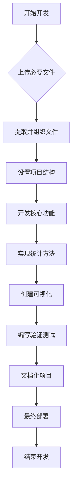

# 文件层级
pythonProject/
│
├── README.md
├── setup.py
├── requirements.txt
├── src/
│   ├── __init__.py
│   ├── main.py
│   ├── utils.py
│   ├── analysis/
│   │   ├── __init__.py
│   │   ├── statistical_analysis.py
│   │   └── visualization.py
│   └── data/
│       ├── __init__.py
│       └── data_processing.py
└── tests/
    ├── __init__.py
    ├── test_main.py
    └── test_utils.py
